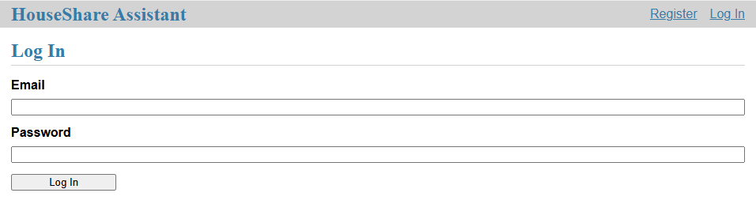
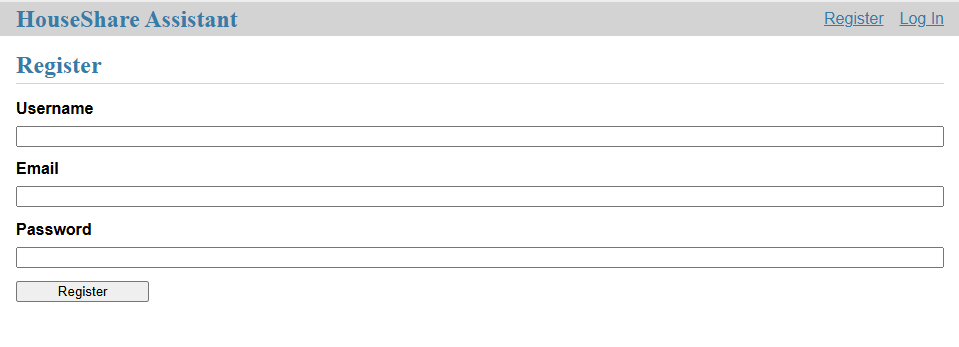
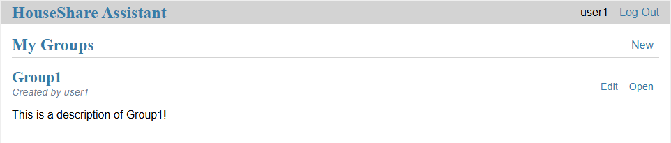
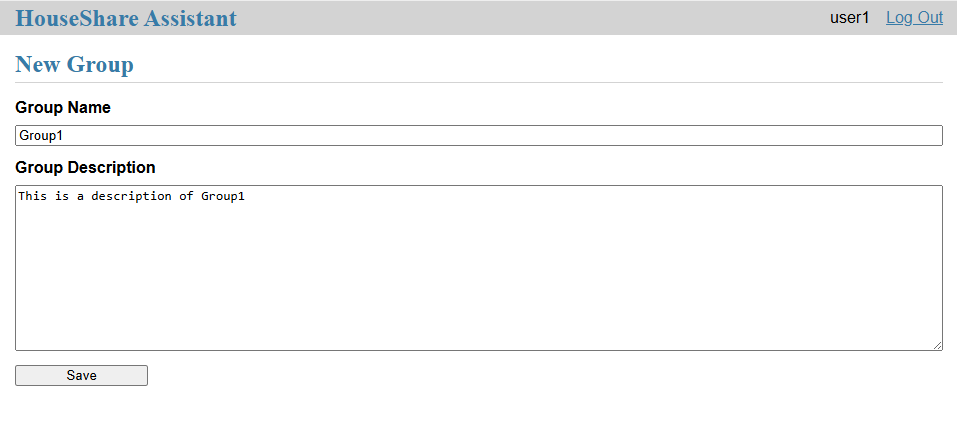
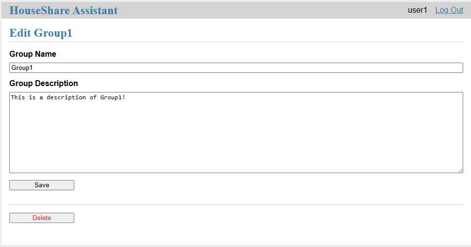
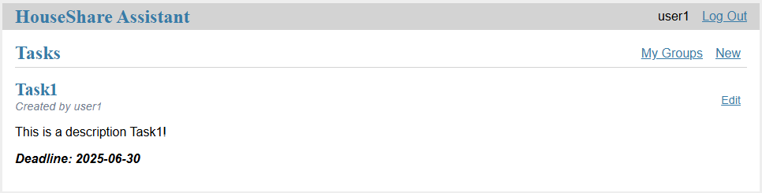
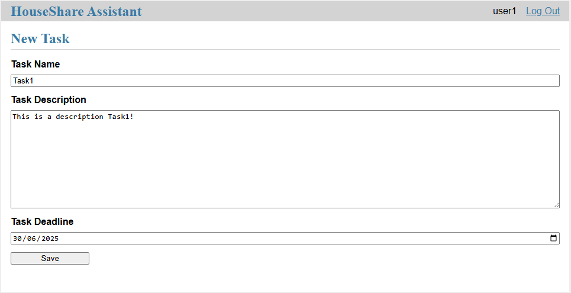

Usage
=====
The following page will talk through all the features of the HouseShare Assistant app including what they do and how to use them.

Login/Registration
------------------

When you first open the app, you will be prompted with the login screen. If you already have an account with HouseShare Assistant then type in your email and associated password.
If not then press the 'Register' button in the top right corner of the page instead and enter your username, email and password to create an account. After registration, you will be
redirected to the login page to type in your account details.

.. note::
    If at any point you would like to change user or create a new account, simply log out using the 'Log out' button in the top right of the screen and you will be returned to the login page of
    the web application

*Figure 1 - HouseShare Assistsant login page*

*Figure 2 - HouseShare Assistsant registration page*

Groups
------

After logging into the HouseShare Assistant web application you will be taken to the groups page. From here, you can see the groups that you are apart of, create a group, open the 
task section of a group and edit or delete a group. After you have created, edited or deleted a group, you will be returned to the group page to see the other groups you are in.

.. note::
    Only the creator of the group has the ability to edit and delete the group

*Figure 3 - HouseShare Assistsant group page*

*Figure 4 - HouseShare Assistsant group creation page*

*Figure 5 - HouseShare Assistsant group editing page*

Tasks
-----

If you press the 'Open' button on a group, this wilol take you to the tasks page for that group. From here, you can create, edit or delete tasks for this group. After you have completed any of 
these three actions successfully, you will be returned to the tasks page for that group. If you wish to go back and see the page of the other groups you're in, press the 'My Groups' button just
below the 'Logout' button in the top right of the screen.

.. note::
    Just like the groups page, only the creator of a task can edit or delete that task

*Figure 6 - HouseShare Assistsant task page*

*Figure 7 - HouseShare Assistsant task creation page*

*Figure 8 - HouseShare Assistsant task editing page*